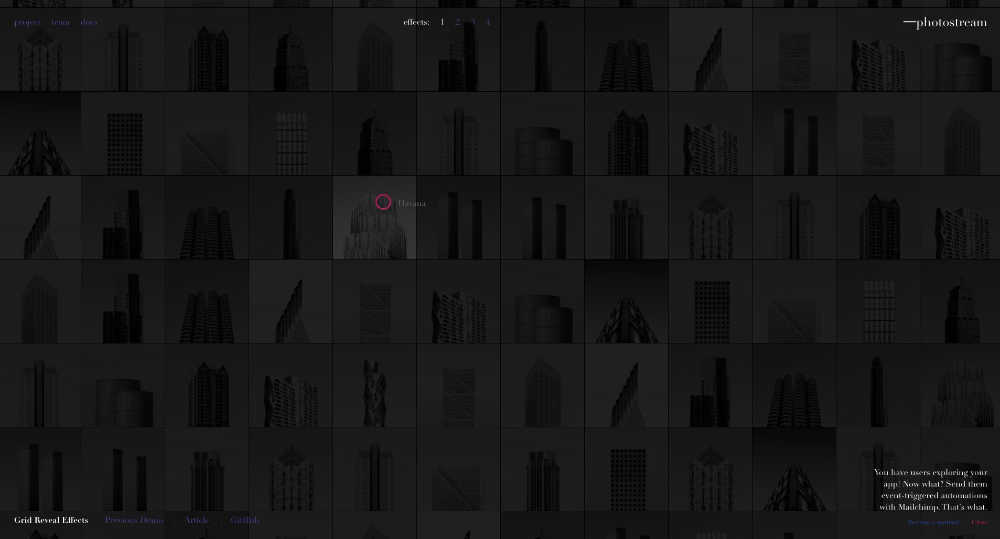

# anime js

[anime js](https://www.animejs.cn/)

Anime.js 是一個輕量JavaScript動畫庫， 擁有簡單而強大的API。 可對 CSS 屬性、 SVG、 DOM 和JavaScript 對象進行動畫。

### 範例

[Moving letters](https://tobiasahlin.com/moving-letters/)

有些文字動畫不是很穩定。

[Letter Effects](https://tympanus.net/Development/LetterEffects/)

和 Moving letters 類似。

# codrops

[codrops](https://tympanus.net/codrops/)

分享前端視覺設計效果的網站，提供source，佛心來著。
Playground單元提供許多資源、Articles單元則是整理推薦的各種網站等等。

### 範例

[Create a Wave Motion Effect on an Image with Three.js](https://tympanus.net/codrops/2020/03/17/create-a-wave-motion-effect-on-an-image-with-three-js/)

[Smooth Scrolling Image Effects](https://tympanus.net/Development/SmoothScrollingImageEffects/)

[Grid Reveal Effects](https://tympanus.net/Development/GridRevealEffects/)
